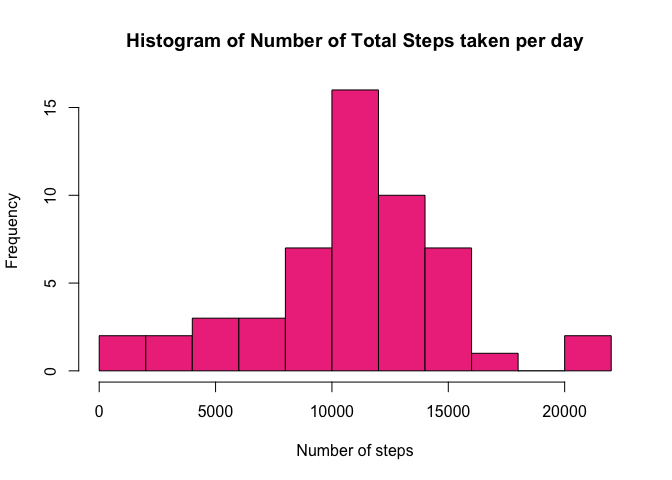
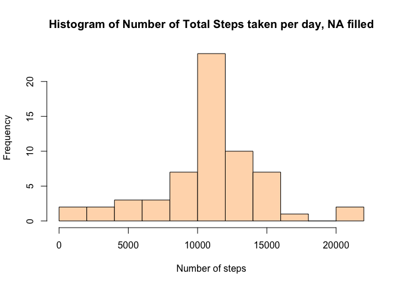
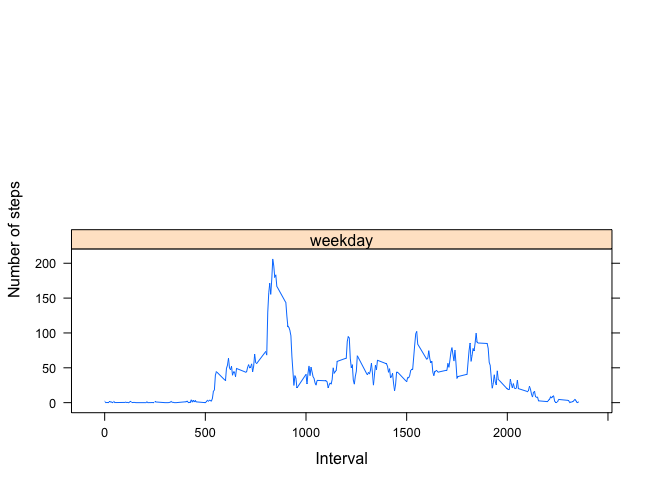

# Reproducible Research: Peer Assessment 1
##Introduction
This assignment makes use of data from a personal activity monitoring device. This device collects data at 5 minute intervals through out the day. The data consists of two months of data from an anonymous individual collected during the months of October and November, 2012 and include the number of steps taken in 5 minute intervals each day.

##Data Source
Dataset Available here:https://d396qusza40orc.cloudfront.net/repdata%2Fdata%2Factivity.zip

**Fileformat:** CSV

17,568 observations presented

**Variables**:

* *steps*: Number of steps taking in a 5-minute interval (missing values are coded as NA)

* *date*: The date on which the measurement was taken in YYYY-MM-DD format

* *interval*: Identifier for the 5-minute interval in which measurement was taken

## Loading and preprocessing the data

```r
knitr::opts_chunk$set(fig.path='figures/')
```

```r
##Unzipping file fromm the forked repository
if(!file.exists('activity.csv')){
        unzip('activity.zip')
}
activity_data <- read.csv("activity.csv")

##Formatting dates as Date
activity_data$date <- as.Date(activity_data$date,"%Y-%m-%d")
```


## What is mean total number of steps taken per day?
#### 1. Make a histogram of the total number of steps taken each day

```r
Total_steps_day <- tapply(activity_data$steps, activity_data$date,sum)

##Plotting the histogram (number of breaks was find by plotting several plots)
hist(Total_steps_day, breaks=10, col="violetred2",xlab="Number of steps", 
     ylab="Frequency", main="Histogram of Number of Total Steps taken per day")
```



####2. Calculate and report the mean and median total number of steps taken per day

```r
Mean_tsd2 <- mean(Total_steps_day, na.rm = TRUE)
Median_tsd2 <- median(Total_steps_day,na.rm = TRUE)
```
Mean is:

```r
print(Mean_tsd2)
```

```
## [1] 10766.19
```

Median is:

```r
print(Median_tsd2)
```

```
## [1] 10765
```

## What is the average daily activity pattern?
####1. Make a time series plot (i.e. type = "l") of the 5-minute interval (x-axis) and the average number of steps taken, averaged across all days (y-axis)

```r
mean_steps <- tapply(activity_data$steps,activity_data$interval,
                    mean,na.rm=TRUE)
plot(names(mean_steps), mean_steps , type="l", xlab="5 minutes intervals", 
     ylab="Mean number of steps (during all Days)", 
     main="Average Steps Taken at 5 minute Intervals",
     col="blue")
```


###Plotting a little bit more beatiful plot ( with time at x-axis)

```r
##Function to create x-axis
intName <- function(interval) {
        if (as.numeric(interval) < 10) {
                t_interval = paste("00:0",interval, sep="")
        } else if (as.numeric(interval) >= 10 && as.numeric(interval) < 100) {
                t_interval = paste("00:", interval, sep="")
        } else if (as.numeric(interval) >= 100 && as.numeric(interval) < 1000) {
                t_interval = paste("0", substr(interval,1,1),":", substr(interval,2,3), sep="")
        } else {
                t_interval = paste(substr(interval,1,2),":", substr(interval,3,4), sep="")
        }
}
yax<-names(mean_steps)
for (i in 1:length(names(mean_steps))){
                yax[i]<-intName(names(mean_steps)[i])
}

yax<-as.factor(yax)
plot(yax, mean_steps, xlab="5 minutes intervals", 
     ylab="Mean number of steps (during all Days)", 
     main="Average Steps Taken at 5 minute Intervals",
     col="blue")
```


####2. Which 5-minute interval, on average across all the days in the dataset, contains the maximum number of steps?


```r
#5-minutes interval with maximum steps taken
max_steps_interval <- which.max(mean_steps)
msi <- names(max_steps_interval)
print(msi)
```

```
## [1] "835"
```
Which means that tome interval "8:35" is interval with maximum steps taken on average.

## Imputing missing values
####1. Calculate and report the total number of missing values in the dataset (i.e. the total number of rows with NAs)

```r
mis_val <- sum(is.na(activity_data$steps))
```
Totla number of NAs presented:

```r
print(mis_val)
```

```
## [1] 2304
```

####2.Devise a strategy for filling in all of the missing values in the dataset. The strategy does not need to be sophisticated.

Lets fill the NA with average value for the corresponding 5-minute interval.

####3. Create a new dataset that is equal to the original dataset but with the missing data filled in.

```r
Activity_data_filled <- activity_data

for (i in 1:nrow(Activity_data_filled)){
        if (is.na(Activity_data_filled$steps[i]) == TRUE){
                Activity_data_filled$steps[i] <- mean_steps[which(
                        as.numeric(names(mean_steps)) == Activity_data_filled$interval[i])]
        }
}
```

####4. Make a histogram of the total number of steps taken each day and Calculate and report the mean and median total number of steps taken per day. Do these values differ from the estimates from the first part of the assignment? What is the impact of imputing missing data on the estimates of the total daily number of steps?

```r
Total_steps_day_filled <- tapply(Activity_data_filled$steps, Activity_data_filled$date,sum)

##Plotting the histogram (number of breaks was find by plotting several plots)
hist(Total_steps_day_filled, breaks=10, col="peachpuff",xlab="Number of steps", 
     ylab="Frequency", main="Histogram of Number of Total Steps taken per day, NA filled")
```


Calculate and report the mean and median total number of steps taken per day on the imputed dataset

```r
Mean_tsd_filled<- mean(Total_steps_day_filled)
Median_tsd_filled <- median(Total_steps_day_filled)
```
Mean of the dataset with filled NAs is:

```r
print(Mean_tsd_filled)
```

```
## [1] 10766.19
```
Median of the dataset with filled NAs is:

```r
print(Median_tsd_filled)
```

```
## [1] 10766.19
```
Mean is the same, cause we used meanvalue of the intervals to substitute NA's. 
Median became a bit higher and equal to Mean.


## Are there differences in activity patterns between weekdays and weekends?

####Create a new factor variable in the dataset with two levels -- "weekday" and "weekend" indicating whether a given date is a weekday or weekend day.

```r
##Adding column with type of the day
Activity_data_filled$day_type <- weekdays(as.Date(Activity_data_filled$date))
Activity_data_filled$day_type <- ifelse(Activity_data_filled$day_type %in% c("Saturday", "Sunday"),"weekend", "weekday")
Activity_data_filled$day_type <-as.factor(Activity_data_filled$day_type)


##Aggegating by type of the day and time intervals
mean_tsd_final <- aggregate(Activity_data_filled$steps,
                       by=list(Activity_data_filled$interval,
                               Activity_data_filled$day_type),mean)

names(mean_tsd_final) <- c("interval","day_type","steps")
```

####2.Make a panel plot containing a time series plot (i.e. type = "l") of the 5-minute interval (x-axis) and the average number of steps taken, averaged across all weekday days or weekend days (y-axis).


```r
##Plotting results
library(lattice)
xyplot(steps ~ interval | day_type, data = mean_tsd_final, layout = c(1, 2), type="l", xlab = "Interval", ylab = "Number of steps")
```


